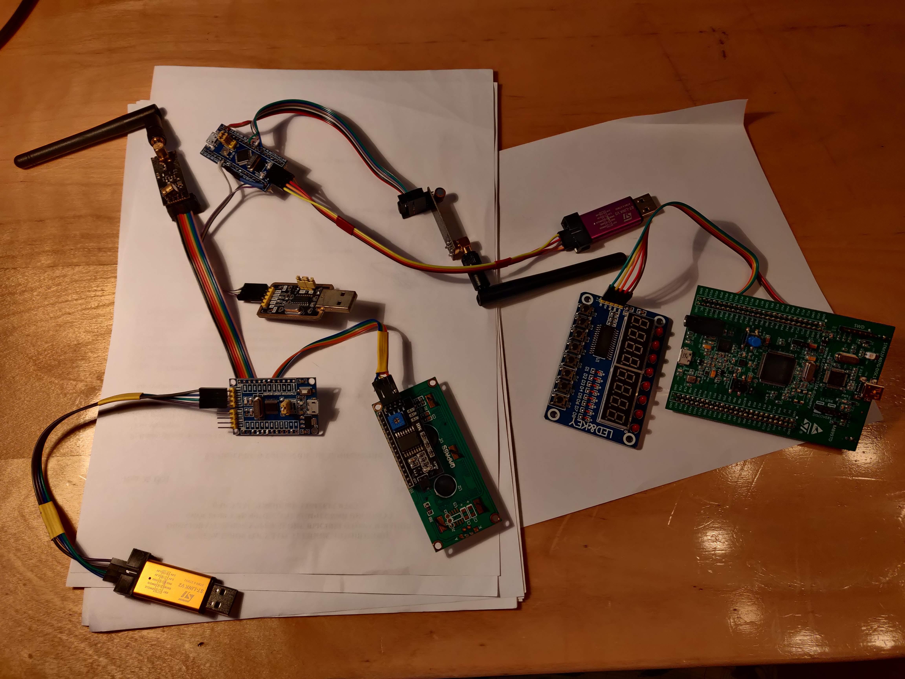

# stm32 projects for passing second year at mipt

## Библиотеки
1. LCD 16*2 через i2c переходник
2. nrf42l01

## Функционал
1. Определение подключено ли устройство
2. Передача строки 16 символов с uart на беспроводной терминал
3. Обратная связь о доставке строки + кол-во попыток для отправки
4. Если терминал теряет связть, то это отображается как на нем так и в uart
5. У моей stm32f103c8t6 которую я использовал почему-то не работает usb virtual com, по этому работает через переходник

## Фото железа

## Железо
1. stm32f103c8t6 - передатчик
2. stm32f030f4p6 - приемник
3. две nrf24l01+ с усилителем и антеной
4. lcd 16*2
5. расширитель портов i2c pcf8574t

> в процессе работы еще набросал либы для tm1638 - расширитель портов spi на вход и выход. Планировалось его использовать.

> весь код выполнет в stm32cobeMxIde последней версии